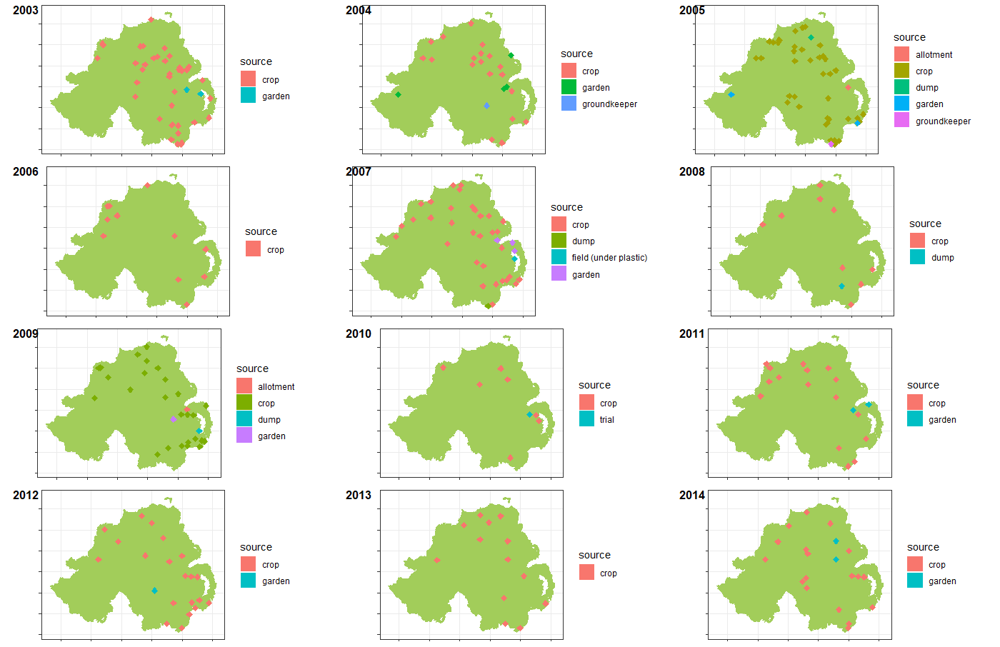

```{r setup, include=FALSE}
knitr::opts_chunk$set(echo = TRUE)
```

## Libraries

```{r libs, message=FALSE, warning=FALSE}
list.of.packages <-
  c(
    "tidyverse",
    "readxl",
    "broom", 
    "data.table",
    "minpack.lm",
    "knitr",
    "zoo",
    "egg",
    "ggthemes",
    "here",
    "stringr",
    "lubridate",
    "nlme",
    "pander",
    "maps",
    "ggrepel",
    "sf",
    "ggspatial",
    "factoextra", 
    "NbClust"
  )

new.packages <-
  list.of.packages[!(list.of.packages %in% installed.packages()[, "Package"])]

#Download packages that are not already present in the library
if (length(new.packages))
  install.packages(new.packages)

if (length(new.packages))
  install.packages(new.packages, repos = c(CRAN="https://cran.r-project.org/"))


if ("reconPlots" %in% installed.packages() == FALSE) devtools::install_github("andrewheiss/reconPlots")

packages_load <-
  lapply(list.of.packages, require, character.only = TRUE)

#Print warning if there is a problem with installing/loading some of packages
if (any(as.numeric(packages_load) == 0)) {
  warning(paste("Package/s", paste(list.of.packages[packages_load != TRUE]), "not loaded!"))
} else {
  print("All packages were successfully loaded.")
}

rm(packages_load, list.of.packages, new.packages)

```

## Background 

I guess the whole idea about this is related to some of my PhD projects that I could not finish. I had a pile of yearbooks with initial disease outbreaks and follow-up assessments from early 1950s to late 1990s. The thickness of these yearbooks was slimmer and slimmer towards end of the last century, hence, beside the historical and theoretical value they would not be of much use for my current project. I have given up on digitising them, because both myself and few of my students started hating me, because they are really messy.  
(Very relevant paper by Zwankhuizen & Zadoks)[https://bsppjournals.onlinelibrary.wiley.com/doi/full/10.1046/j.1365-3059.2002.00738.x], which I think I have mentioned to Neil.  
The main idea related to the current data set is that it is a bit more relevant to current agrosystem. It might be interesting to see how the initial outbreaks, their distribution, rate of increase, etc., is changes over years. This is a observational "study" and comes with all its caveats. These are reports by blight scouts, and it is hard to know if some scouts are more active than others, and similar variables. However, this data is collected by Louise Cooke, and I am sure she would be happy to answer any queries, if it comes to that.  

## Data

The disease outbreak data consisted of the date and coordinates of 352 late blight outbreaks from across Northern Ireland over an 11- year period (2005-2014).
The NI data were collected every year as part of the Agriculture and Horticulture Development Board (AHDB) Potatoes ‘Fight Against Blight’ campaign (https://potatoes.ahdb.org.uk/). 
The coordinates of blight outbreak locations were obtained using the ‘geocoding’ function from the ‘ggmap’ package (Kahle and Wickham 2013) and confirmed manually. The same data set was used in revision of the Hutton Critera, previously known as Smith Periods (some details [here](https://euroblight.net/fileadmin/euroblight/Workshops/AArhus/Proceedings/5._Siobhan_Dancy-p53-58.pdf)). 
```{r load, message=FALSE}
outbreaks <- read_csv(file  = here::here("dat", "outbreaks_fin.csv"))

outbreaks$date <- lubridate::mdy(outbreaks$date)

outbreaks$jday <- as.Date(outbreaks$date,format="%m/%d/%Y") %>% yday()


#Remove outbreaks from 
outbreaks <- 
  outbreaks %>%
  filter(lat>53.9) 
   
outbreaks <- 
  outbreaks %>% 
   
    mutate(source = tolower(source)) %>% 
    mutate(source = ifelse(source == "Crop", "crop", 
                         ifelse(source == "crops", "crop",source))) %>% 
    mutate(source = ifelse(source == "groundkeepers", "groundkeeper", source)) %>% 
    mutate(source = ifelse(source == "allotments", "allotment", source)) 

```
A look at data set. 
```{r data, out.width= "100%"}
pander(head(outbreaks))
```
Varieties present in the data. I know most of them, and all are traditional varieties with not partial resistance. 
```{r}
unique(outbreaks$ variety)

```
This is the data summary for different sources. 
```{r}
outbreaks %>% 
  group_by(yr, source) %>% 
  summarise(counts = n()) %>% 
  spread(yr, counts)%>% 
  replace(is.na(.), 0) %>% 
  pander()

```

The entire data set can be seen [here](https://github.com/mladencucak/Outbreaks/blob/master/dat/outbreaks_fin.csv)  

!!TASK plot outbreak maps for each year  
```{r}
# ni_sf <-
# all_counties.sf[all_counties.sf$CountyName  == c("Tyrone","Antrim","Armagh", "Fermanagh","Londonderry","Down"),]
# basemap <- 
# ggplot() +
#   # Plot borders (shapefile)
#   geom_sf(
#     data = ni_sf
#       ,
#     color= "darkolivegreen3",
#     fill = "darkolivegreen3"
#   ) +
#   #Set the theme
#   theme_bw(
#            
#   ) +
#   #limit the plotting area
#   coord_sf(xlim = c(-8.4, -4.9), ylim = c(54, 55.4), expand = FALSE) +
# theme(axis.text.x=element_blank(),
#       axis.text.y=element_blank())
#   # Define names for labs
#   labs(x = "Longitude", y = "Latitude")+
#   #add fancy anotation
#   annotation_north_arrow(location = "br", which_north = "true", 
#                          pad_x = unit(0.35, "in"),
#                          pad_y = unit(0.25, "in"),
#                          style = north_arrow_fancy_orienteering) +
#   
#   annotation_scale(location = "br", width_hint = 0.4) 
# 
# plist <- list()
# for(i in seq(unique(df_loc_sf$yr))){
#   yrs <- unique(df_loc_sf$yr)[i]
#   
#   plist[[i]] <- 
#   basemap+
#     geom_sf(
#       data = df_loc_sf[df_loc_sf$yr == unique(df_loc_sf$yr)[i],],
#       aes(fill = source, color = source),
#       shape = 23,
#       size = 2
#     ) +
#     geom_point( size = .5)
# }
# 

```
 `

## Model fitting
### Prepare the data
```{r}

```

Initially, a simple cumulative sum per year was calcualted with julian day and year as covariates. 
```{r}
cdfdt <- 
outbreaks[outbreaks$Location!= "Oak Park",] %>%
  mutate(mon = month(date),
         day = day(date)) %>%
  group_by(mon, day) %>%
  unite(., date, mon, day, sep = "-", remove = FALSE) %>%
  mutate(d = as.Date(date, format = "%m-%d")) %>%
  ungroup() %>% 
  select(yr,jday) %>% 
  group_by(yr,jday) %>%
  summarise(count = n()) %>% 
  ungroup() %>% 
  group_by(yr) %>% 
  mutate(cums = cumsum(count)) %>% 
  dplyr::select(.,yr, jday, cums) %>% 
  ungroup() %>% 
  mutate(year = yr,
         yr = as.factor(yr-min(yr-1)))

pander::pander(cdfdt[1:20,])
```


```{r}
cdfdt %>% 
mutate(lab =paste0(year," (",yr,")")) %>% 
ggplot() +
  geom_line(aes(jday, cums))+
  facet_wrap(~ lab, ncol = 3)+
  labs(y = "Cumulative sum of outbreaks",
       x = "Date") +
  theme_article()+
ggsave(here::here("out", "Cumsum of outbreaks per year.png"),
       width = 6,
       height = 4.5,
       dpi = 620)
```

### Fit the model

Get the starting values. 
```{r e}
start_vals <- 
  cdfdt %>%
  filter(yr != "8") %>%
  nlsList(cums ~ SSlogis(jday, Asym, xmid, scal) | yr,
          data = .)
# broom::tidy(start_vals)
```


```{r init_vals, out.width="100%", out.height=5}
start_vals

start_vals %>%
  intervals %>%
  plot

pairs(start_vals, id = 0.1)
```


Logistic fit with julian day as predictor and year as random grouping variable. 

```{r pairs_plot, out.width="100%"}
# Fit on lnear model with logistic fuction
w1 <- 
  cdfdt %>%
  filter(yr != "8") %>%
  nlme(cums ~ SSlogis(jday, Asym, xmid, scal),# model evaluates the logistic function and its gradient
       fixed = list(Asym ~ 1,
                    xmid ~ 1,
                    scal ~ 1),#Fixed effects of the 
       #random parameters of the model grouped by  year
       #to reduce the number of parameters, the scale and it was excluded because it does not impact the model fit
       random = Asym + xmid  ~ 1 | yr,
       data = .,
       start = fixef(start_vals)#Start parameters for the optimisation alghorithm
       )

```


Calculate the predictions. 
```{r}
cdfdt_pred <- 
  cdfdt %>%
  filter(yr != "8") %>%
  mutate(pred = predict(w1))


```


Plot predicted values. 
```{r}
cdfdt_pred %>% 
  mutate(lab =paste0(year," (",yr,")")) %>% 
ggplot() +
  geom_line(aes(jday, cums))+
  facet_wrap(~ lab, ncol = 3)+
  labs(y = "Cumulative sum of outbreaks",
       x = "Date") +
  theme_article() +
  geom_line(aes(jday, pred), col = 2)

```


Extract parameter values.
```{r}
params <- 
cdfdt_pred %>% 
  mutate(lab =paste0(year," (",yr,")")) %>% 
  group_by(lab) %>%
  summarise(year = unique(lab)) %>% 
  ungroup() %>% 
  select(year) %>% 
  bind_cols(coef(w1)) %>% 
  write_csv(here::here("out" , "paramter_est_per_year.csv"))
```


## Clustering 
Aplication of any method is limited due to low number of data points.  

### Estimate optimum number of clusters  
althoug there are numerous methods to hel determining the number of clusters, in the end it is 
a subjective decision.
```{r}
# Elbow method
#Minimising the toal sum of squares
# choose a number of clusters so that adding another cluster doesn’t improve much better the total WSS
fviz_nbclust(params[, 2:4], kmeans, method = "wss") +
  labs(subtitle = "Elbow method:The location of a bend (knee) in the\n plot is generally considered as an indicator of the appropriate number of clusters.")

# Silhouette method
# it measures the quality of a clustering.
# That is, it determines how well each object lies within its cluster. 
# A high average silhouette width indicates a good clustering.
fviz_nbclust(params[, 2:4], kmeans, method = "silhouette")+
  labs(subtitle = "Silhouette method")

```

According to these results and our subjective feeling,
it is possible to define k = 3 as the optimum number of clusters in the data.

```{r}
#Seeds allow you to create a starting point for randomly generated numbers, 
#so that each time your code is run, the same answer is generated
set.seed(20)
clusters <-
kmeans(params[, 2:4],3, nstart = 20)

#number of points in each cluster
clusters$size
#vector of within-cluster sum of squares, one component per cluster.
clusters$withinss
clusters$tot.withinss # total within-cluster sum of squares

params$group <- as.factor(clusters$cluster)

```

Plot the observed and predicted curves and the cluster they are assigned to.  
```{r plot_clusters, fig.height=7, fig.width=7}
cdfdt_pred %>% 
  mutate(year =paste0(year," (",yr,")")) %>% 
  left_join(., params[, c("group", "year")]) %>% 
  mutate(group = paste0("cl ",as.character(group) )) %>% 
ggplot() +
  geom_line(aes(jday, cums))+
  geom_label(aes(x = 150, y=40,label = group))+
  facet_wrap(group ~ year, ncol = 3)+
  labs(y = "Cumulative sum of outbreaks",
       x = "Date") +
  theme_article() +
  geom_line(aes(jday, pred), col = 2)

```

### Dendograms
Create dendogram. 
```{r}
res.dist <- dist(params[, 2:4], method = "euclidean")

as.matrix(res.dist)[1:6, 1:6]
res.hc <- hclust(d = res.dist, method = "ward.D2")

# cex: label size
library("factoextra")
fviz_dend(res.hc, cex = 1)

# Compute cophentic distance
res.coph <- cophenetic(res.hc)

# Correlation between cophenetic distance and
# the original distance
cor(res.dist, res.coph)

res.hc2 <- hclust(res.dist, method = "average")

cor(res.dist, cophenetic(res.hc2))

# Cut tree into 4 groups
grp <- cutree(res.hc, k = 4)
head(grp, n = 4)
# Number of members in each cluster
table(grp)

```


